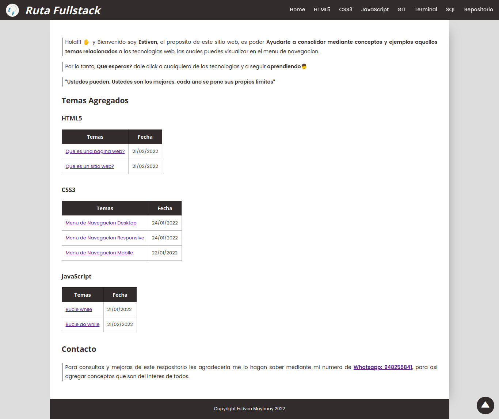
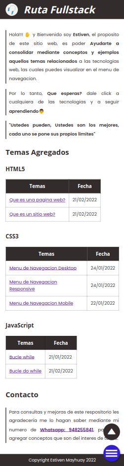

# **Ruta FullStack**

> Colaboracion de ~Estiven M.

> Es un sitio web de creacion propia que te permitira aprender aquellos conceptos importantes para ser un **desarrollador frontend o backend**, mediante ejercicios practicos. Asi que visita el sitio aqui: [https://estivenmayhuay.github.io/Ruta-FullStack/](https://estivenmayhuay.github.io/Ruta-FullStack/)

## **Tecnologias**

- HTML5
- CSS3
- Pug
- Javascript

## **Vistas**

> Vista Desktop

> Vista mobile

